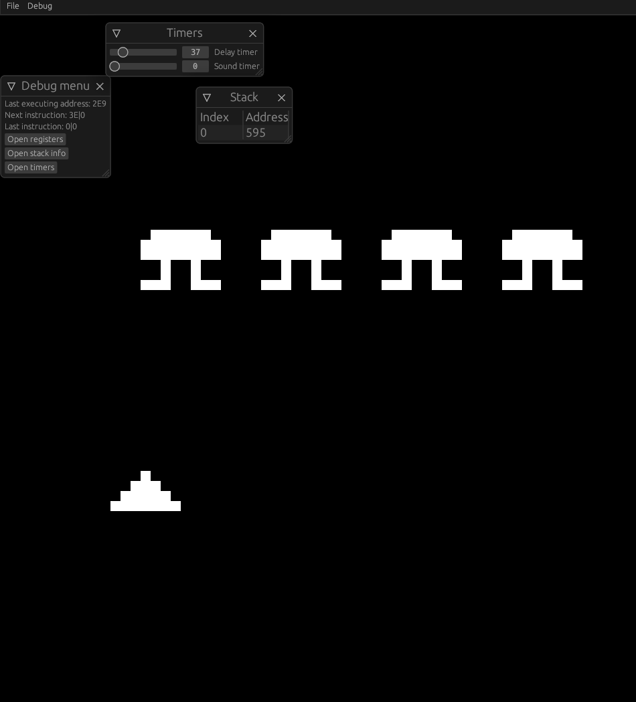

## About this project
Yes, this is another CHIP-8 emulator written in Rust. Goals:
- [x] Implement all CHIP-8 instructions  and architecture
- [x] Make a debug GUI
- [x] Implement all SCHIP-48 instructions and architecture (searching for bugs ATM)

Some screenshots of the emulator:


In the future I might implement XO-CHIP instructions and definitely want to rework some elements of GUI. The project is being actively developed, so follow for updates!
## Installation
```
git clone https://github.com/NinVoido/chip-8-rust
cd chip-8-rust
cargo build --release
```
The binary will appear in target folder
